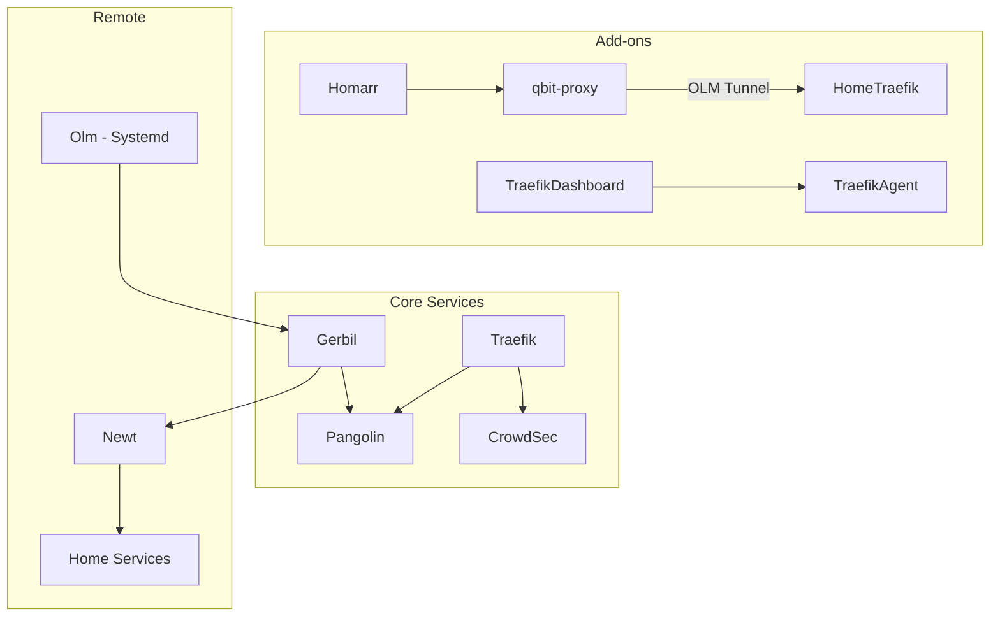

# Pangolin Stack Infrastructure

This document provides detailed infrastructure documentation for AI agents and developers working with this stack.

## Network Architecture

```
                                    ┌─────────────────────────────────────┐
                                    │            INTERNET                  │
                                    └──────────────────┬──────────────────┘
                                                       │
                                                       ▼
                                    ┌─────────────────────────────────────┐
                                    │           CLOUDFLARE                 │
                                    │    DNS: *.dennisb.xyz → VPS IP       │
                                    │    Proxy: Orange cloud enabled       │
                                    └──────────────────┬──────────────────┘
                                                       │
                                                       ▼
┌──────────────────────────────────────────────────────────────────────────────────────┐
│                                   VPS (51.195.100.11)                                 │
│                                                                                       │
│  ┌─────────────┐    ┌─────────────┐    ┌─────────────┐    ┌─────────────┐            │
│  │   Traefik   │◄───│  Pangolin   │    │   Gerbil    │    │  CrowdSec   │            │
│  │  :80, :443  │    │   :3001     │    │  :51820/udp │    │   :8080     │            │
│  └──────┬──────┘    └─────────────┘    └──────┬──────┘    └─────────────┘            │
│         │                                      │                                      │
│         │ Routes requests                      │ WireGuard                            │
│         ▼                                      │ tunnel                               │
│  ┌─────────────┐    ┌─────────────┐            │                                      │

│  └─────────────┘    └──────┬──────┘                                                   │
│                            │                                                          │
└────────────────────────────┼──────────────────────────────────────────────────────────┘
                             │
                             │ WireGuard tunnel via
                             │ Pangolin/Gerbil relay
                             │
                             ▼
┌──────────────────────────────────────────────────────────────────────────────────────┐
│                              HOME NETWORK (192.168.0.0/24)                            │
│                                                                                       │
│  ┌─────────────┐    ┌─────────────┐    ┌─────────────┐    ┌─────────────┐            │
│  │   Traefik   │◄───│  Pangolin   │    │   Gerbil    │    │  CrowdSec   │            │
│  │  :80, :443  │    │   :3001     │    │  :51820/udp │    │   :8080     │            │
│  └──────┬──────┘    └─────────────┘    └──────┬──────┘    └─────────────┘            │
│         │                                      │                                      │
│         ▼                                      │ WireGuard tunnel                     │
│  ┌─────────────┐    ┌─────────────┐            │ (to Home Newt)                       │
│  │   Homarr    │◄───┤  qbit-proxy │◄───────────┘                                      │
│  │   :7575     │    │   :8081     │  (via OLM)                                       │
│  └─────────────┘    └─────────────┘                                                   │
└──────────────────────────────────────────────────────────────────────────────────────┘
```

## Service Dependencies



## Docker Compose Files

| File | Purpose | Services |
|------|---------|----------|
| `docker-compose.yml` | Core infrastructure | traefik, pangolin, gerbil, crowdsec, portainer |
| `docker-compose.addons.yml` | Dashboard & tools | olm, middleware-manager, traefik-dashboard, crowdsec-web-ui, dashdot, linkstack |
| `docker-compose.tools.yml` | Utilities | maxmind-updater |

## Olm Tunnel Configuration

Olm is currently running as a **systemd service** on the VPS host to ensure it has the necessary network permissions and stability.

### Management
```bash
sudo systemctl status olm
sudo journalctl -u olm -f
```

## qBittorrent Proxy Sidecar

Homarr v0.15+ has a known issue with qBittorrent v5.1.4+ API responses when served over HTTPS with "Secure" cookies. The `qbit-proxy` service acts as a bridge:

1. **Strips Secure Flag**: Removes `secure;` from cookies so Homarr can see them.
2. **Handles SNI**: Properly sets the `Host: torrent.dennisb.xyz` header.
3. **Internal HTTP**: Allows Homarr to connect via plain HTTP internally.

### Access Pattern

```
Widget URL: http://qbit-proxy:8081
    ↓ Proxy translation
Destination: https://192.168.0.10:443
    ↓ SNI injection
Host Header: torrent.dennisb.xyz
    ↓ OLM tunnel
Home Traefik
```

### Widget Access Pattern

```
Widget URL: https://sonarr.dennisb.xyz
    ↓ extra_hosts override
Resolved: 192.168.0.10:443
    ↓ Olm tunnel
Home Traefik (SNI routing)
    ↓
Sonarr container
```

## Troubleshooting Commands

### Olm Tunnel

```bash
# Check tunnel status
docker logs olm --tail 20

# Verify interface exists
ip addr show olm

# Test connectivity
ping 192.168.0.10

# Check routes
ip route | grep 192.168.0

# Restart tunnel
docker restart olm
```


### CrowdSec

```bash
# Check decisions
docker exec crowdsec cscli decisions list

# Check bouncers
docker exec crowdsec cscli bouncers list

# View alerts
docker exec crowdsec cscli alerts list
```

## Environment Variables

Key variables in `.env`:

| Variable | Purpose |
|----------|---------|
| `TRAEFIK_DASHBOARD_TOKEN` | Auth token for traefik-dashboard |
| `CROWDSEC_AGENT_KEY` | CrowdSec agent registration key |

## Permissions Notes

| Path | Required Owner | Why |
|------|----------------|-----|

| `config/crowdsec-web-ui/` | Container writable | SQLite database |
| `/var/run/docker.sock` | root:docker (986) | Docker API access |

If permissions break, fix with:
```bash
sudo chmod 666 config/crowdsec-web-ui/crowdsec.db*

```
