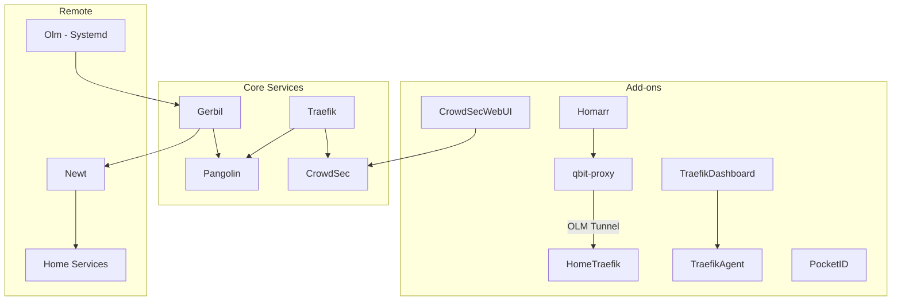

# Pangolin Stack Infrastructure

This document provides detailed infrastructure documentation for AI agents and developers working with this stack.

## Network Architecture

```
                                    ┌─────────────────────────────────────┐
                                    │            INTERNET                  │
                                    └──────────────────┬──────────────────┘
                                                       │
                                                       ▼
                                    ┌─────────────────────────────────────┐
                                    │           CLOUDFLARE                 │
                                    │    DNS: *.example.com → CloudNode IP       │
                                    │    Proxy: Orange cloud enabled       │
                                    └──────────────────┬──────────────────┘
                                                       │
                                                       ▼
┌──────────────────────────────────────────────────────────────────────────────────────┐
│                                   CloudNode (203.0.113.1)                                 │
│                                                                                       │
│  ┌─────────────┐    ┌─────────────┐    ┌─────────────┐    ┌─────────────┐            │
│  │   Traefik   │◄───│  Pangolin   │    │   Gerbil    │    │  CrowdSec   │            │
│  │  :80, :443  │    │   :3001     │    │  :51820/udp │    │   :8080     │            │
│  └──────┬──────┘    └─────────────┘    └──────┬──────┘    └─────────────┘            │
│         │                                      │                                      │
│         │ Routes requests                      │ WireGuard                            │
│         ▼                                      │ tunnel                               │
│  ┌─────────────┐    ┌─────────────┐            │                                      │

│  └─────────────┘    └──────┬──────┘                                                   │
│                            │                                                          │
└────────────────────────────┼──────────────────────────────────────────────────────────┘
                             │
                             │ WireGuard tunnel via
                             │ Pangolin/Gerbil relay
                             │
                             ▼
┌──────────────────────────────────────────────────────────────────────────────────────┐
│                              HOME NETWORK (192.168.1.0/24)                            │
│                                                                                       │
│  ┌─────────────┐    ┌─────────────┐    ┌─────────────┐    ┌─────────────┐            │
│  │   Traefik   │◄───│  Pangolin   │    │   Gerbil    │    │  CrowdSec   │            │
│  │  :80, :443  │    │   :3001     │    │  :51820/udp │    │   :8080     │            │
│  └──────┬──────┘    └─────────────┘    └──────┬──────┘    └─────────────┘            │
│         │                                      │                                      │
│         ▼                                      │ WireGuard tunnel                     │
│  ┌─────────────┐    ┌─────────────┐            │ (to Home Newt)                       │
│  │   Homarr    │◄───┤  qbit-proxy │◄───────────┘                                      │
│  │   :7575     │    │   :8081     │  (via OLM)                                       │
│  └─────────────┘    └─────────────┘                                                   │
└──────────────────────────────────────────────────────────────────────────────────────┘
```

## Service Dependencies



## Docker Compose Stacks

Stacks are organized in `stacks/<stack>/docker-compose.yml`:

| Stack | Purpose | Services |
|-------|---------|----------|
| `core` | Infrastructure (starts first) | pangolin, gerbil, traefik |
| `security` | Protection & auth | crowdsec, crowdsec-web-ui, pocket-id |
| `dns` | DNS-over-HTTPS & filtering | adguard-home, adguardhome-sync |
| `observability` | Monitoring & logs | traefik-agent, traefik-dashboard, dashdot |
| `management` | Container orchestration | dockhand |
| `dashboard` | User dashboards | homarr, qbit-proxy |
| `apps` | User applications | linkstack, termix |

Use `./stackctl.sh status` to view all stacks or `./startup.sh` to start everything.

## AdGuard Home Sync

AdGuard Home on the CloudNode syncs blocklists and settings from the home router (origin) every 12 hours.

### Sync Features
- Blocklists and filters
- DNS rewrites
- Client settings
- General settings

### Management
```bash
# Force immediate sync
docker exec adguardhome-sync /app/adguardhome-sync run

# Check sync logs
docker logs adguardhome-sync --tail 50

# Access web UI
# https://dns.example.com
```

### DoH Endpoint
Devices can use `https://dns.example.com/dns-query` for DNS-over-HTTPS.

## Olm Tunnel Configuration

Olm is currently running as a **systemd service** on the CloudNode host to ensure it has the necessary network permissions and stability.

### Management
```bash
sudo systemctl status olm
sudo journalctl -u olm -f
```

## qBittorrent Proxy Sidecar

Homarr v0.15+ has a known issue with qBittorrent v5.1.4+ API responses when served over HTTPS with "Secure" cookies. The `qbit-proxy` service acts as a bridge:

1. **Strips Secure Flag**: Removes `secure;` from cookies so Homarr can see them.
2. **Handles SNI**: Properly sets the `Host: torrent.example.com` header.
3. **Internal HTTP**: Allows Homarr to connect via plain HTTP internally.

### Access Pattern

```
Widget URL: http://qbit-proxy:8081
    ↓ Proxy translation
Destination: https://192.168.1.10:443
    ↓ SNI injection
Host Header: torrent.example.com
    ↓ OLM tunnel
Home Traefik
```

### Widget Access Pattern

```
Widget URL: https://sonarr.example.com
    ↓ extra_hosts override
Resolved: 192.168.1.10:443
    ↓ Olm tunnel
Home Traefik (SNI routing)
    ↓
Sonarr container
```

## Traefik Config

- Static config: `config/traefik/traefik_config.yml`
- Dynamic rules: `config/traefik/rules/`
- Overrides are disabled and kept as `config/traefik/rules/resource-overrides.yml.back`

## Troubleshooting Commands

### Olm Tunnel

```bash
# Check tunnel status
sudo systemctl status olm
sudo journalctl -u olm -f

# Verify interface exists
ip addr show olm

# Test connectivity
ping 192.168.1.10

# Check routes
ip route | grep 192.168.0

# Restart tunnel
sudo systemctl restart olm
```
If you run Olm via Docker instead of systemd, use `docker logs olm` and `docker restart olm`.

## Geo-Blocking

The stack implements defense-in-depth geo-blocking using both CrowdSec and Traefik to block traffic from high-risk countries.

### Configuration

**Blocked Countries**: CN, RU, KP, IR, VN, IN, PK, BD, NG, BR, ID, UA, KZ  
**Whitelisted**: IL (Israel), EU member states, US, CA, GB, AU, NZ, JP, KR, SG

### Components

1. **CrowdSec GeoIP Enrichment** (`config/crowdsec/scenarios/country-block.yaml`)
   - Enriches logs with country data
   - Bans IPs from blocked countries for 24 hours
   - Uses `crowdsecurity/geoip-enrich` parser

2. **Traefik GeoBlock Middleware** (`config/traefik/rules/geoblock-middleware.yml`)
   - Immediate edge blocking using GeoJS API
   - Applied to: LinkStack, Termix, Homarr, Dashdot
   - Not applied to: PocketID (has own MaxMind), Pangolin, CrowdSec, Dockhand

### Management

```bash
# View geo-blocking alerts
docker exec crowdsec cscli alerts list --origin custom/country-block

# Check blocked decisions
docker exec crowdsec cscli decisions list

# Whitelist an additional country: edit both files
# - config/crowdsec/scenarios/country-block.yaml
# - config/traefik/rules/geoblock-middleware.yml
# Then restart services
docker restart crowdsec
./stackctl.sh restart core
```


### CrowdSec

```bash
# Check decisions
docker exec crowdsec cscli decisions list

# Check bouncers
docker exec crowdsec cscli bouncers list

# View alerts
docker exec crowdsec cscli alerts list

# Geo-blocking metrics
docker exec crowdsec cscli metrics
docker exec crowdsec cscli alerts list -l 20 --origin custom/country-block

# Verify GeoIP enrichment is active
docker exec crowdsec cscli parsers list | grep geoip

# Verify country-block scenario is loaded
docker exec crowdsec cscli scenarios list | grep country
```

## Environment Variables

Key variables in `.env`:

| Variable | Purpose |
|----------|---------|
| `TRAEFIK_DASHBOARD_TOKEN` | Auth token for traefik-dashboard |
| `CROWDSEC_AGENT_KEY` | CrowdSec agent registration key |
| `CROWDSEC_WEB_UI_PASSWORD` | CrowdSec Web UI login |
| `HOMARR_SECRET_KEY` | Homarr encryption key |
| `TELEGRAM_BOT_TOKEN` | Telegram bot token for notifications |
| `TELEGRAM_CHAT_ID` | Telegram chat ID for notifications |
| `POCKET_ID_APP_URL` | Pocket ID public URL |
| `POCKET_ID_ENCRYPTION_KEY` | Pocket ID encryption secret |
| `POCKET_ID_TRUST_PROXY` | Pocket ID proxy trust flag |
| `MAXMIND_ACCOUNT_ID` | MaxMind account ID for Pocket ID |
| `MAXMIND_LICENSE_KEY` | MaxMind license key for Pocket ID |
| `DISABLE_ONLINE_API` | CrowdSec online API toggle |
| `DISABLE_HUB_UPDATE` | CrowdSec hub update toggle |

## Permissions Notes

| Path | Required Owner | Why |
|------|----------------|-----|
| `config/crowdsec-web-ui/` | Container writable | SQLite database |
| `/var/run/docker.sock` | root:docker (986) | Docker API access |

If permissions break, fix with:
```bash
sudo chmod 666 config/crowdsec-web-ui/crowdsec.db*

```
